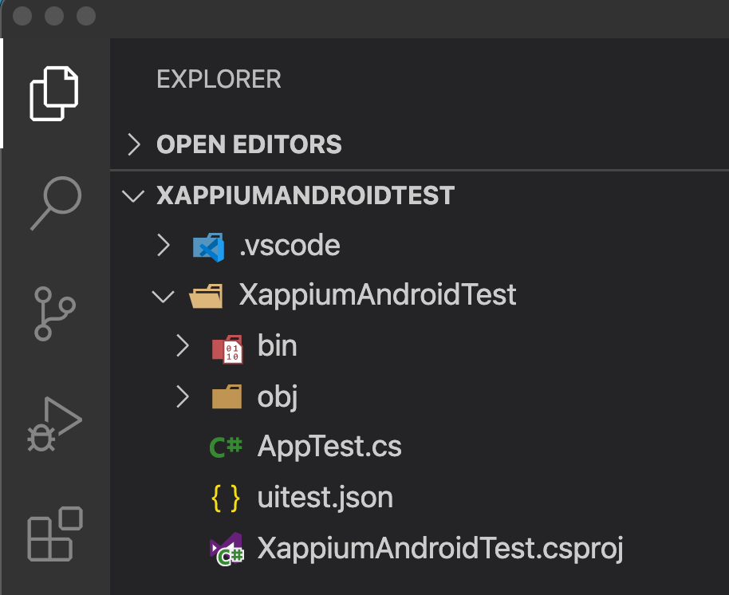
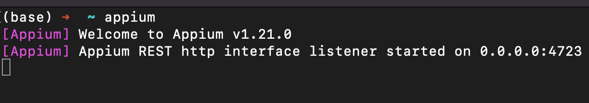
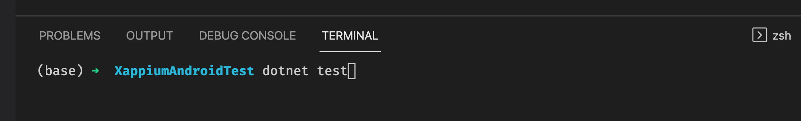
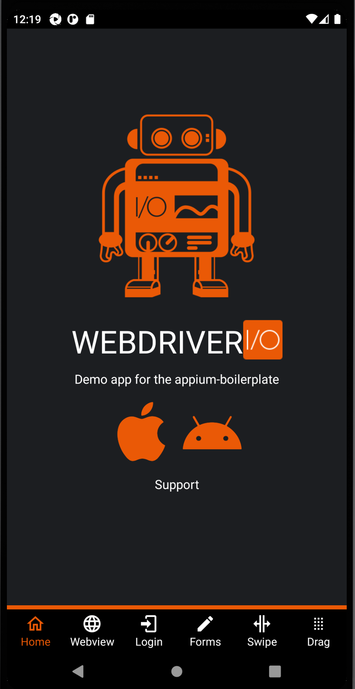
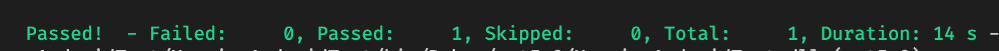

https://xappium.com/	

<br/>

In this tutorial, we will cover how to test Android application using [Xappium](https://github.com/Xappium/xappium.uitest)

### You will need:

* VSCode and dotnet installed.
* Appium installed with all required Environments Variable Setup (see [this post](https://mauiautomation.com/setup-appium-dotnet/) for more details)
* Appium Desktop installed (see my [Appium Desktop](https://mauiautomation.com/appium-desktop-locate-element/) post)


### Let's get started

Open a folder in VSCode and create a dotnet project

```bash
dotnet new classlib -o XappiumAndroidTest
```

Add these packages to `XappiumAndroidTest.csproj`

```csharp
<ItemGroup>
	<PackageReference Include="Microsoft.NET.Test.Sdk" Version="16.11.0" />
	<PackageReference Include="Xappium.UITest" Version="1.0.159-beta" />
	<PackageReference Include="Xappium.UITest.NUnit" Version="1.0.159-beta" />
	<PackageReference Include="NUnit3TestAdapter" Version="4.0.0" />
</ItemGroup>
```

Add `uitest.json` file in `XappiumAndroidTest` folder, and set it as embedded resource by adding this to the .csproj file

```csharp
<ItemGroup>
  <None Remove="uitest.json" />
  <EmbeddedResource Include="uitest.json">
  <CopyToOutputDirectory>PreserveNewest</CopyToOutputDirectory>
  </EmbeddedResource>
</ItemGroup>
```


The `XappiumAndroidTest.csproj` file should now looks like this:

```csharp
<Project Sdk="Microsoft.NET.Sdk">

  <PropertyGroup>
        <TargetFramework>net5.0</TargetFramework>
        <Nullable>enable</Nullable>
    </PropertyGroup>

     <ItemGroup>
      <PackageReference Include="Microsoft.NET.Test.Sdk" Version="16.11.0" />
      <PackageReference Include="Xappium.UITest" Version="1.0.159-beta" />
      <PackageReference Include="Xappium.UITest.NUnit" Version="1.0.159-beta" />
      <PackageReference Include="NUnit3TestAdapter" Version="4.0.0" />
    </ItemGroup>

    <ItemGroup>
      <None Remove="uitest.json" />
      <EmbeddedResource Include="uitest.json">
        <CopyToOutputDirectory>PreserveNewest</CopyToOutputDirectory>
      </EmbeddedResource>
    </ItemGroup>

</Project>

```

Run `dotnet restore` in terminal.


### The `uitest.json`

This is where all Appium UI test configurations should be.

Appium supports both `UIAutomator2` and `Espresso` for Android. Generally, `Espresso` is optimally faster.

Currently Xappium supports `Espresso` only.

Add the following content to the `uitest.json`

```json
{
	"platform": "Android",
	"appPath": "/Users/myuser/Downloads/Android-NativeDemoApp-0.4.0.apk",
	"deviceName": "Pixel 3a Droid10",
	
  "capabilities": {
    "avd": "Pixel_3a_Droid10",
		"allowDelayAdb": "false",
    "appWaitActivity": "*.MainActivity",
    "forceEspressoRebuild": "false",
    "showGradleLog": "true",
    "appium:fullReset": "true"
  }
}
```

​		Cross platfrom capabilities:

> `platform` : this tell Appium server whether test is running on Android or iOS device.
>
> `appPath` : location of the app. This app can be downloaded from  [here](https://github.com/webdriverio/native-demo-app/releases).
>
> `deviceName` : name of the device, in this example, my emulator name is "Pixel 3a Droid10". Update this with your device name.

​		Android specific capabilities:

> `avd` : this capability is Android only, it allows Appium Server to start emulator if it is not running yet.
>
> `allowDelayAdb`:This is optional, but if you run into Failed to connect to Android emulator, set it to `false`. See https://github.com/appium/appium/issues/14773
>
> `appWaitActivity`: at least this or `appActivity` is required by appium. It often is named `MainActivity`. However, it is not always the case. Check out [this post](https://mauiautomation.com/determine-android-app-activity-using-adb/) for more details.

​		Espresso capabilities:

> `forceEspressoRebuild` : If there are ever problems starting a session, try setting the capability `true` and retrying. This will rebuild a fresh Espresso Server APK. If the session is successfull, set it back to `false` so that it doesn't re-install on every single test.
>
> `appium:fullReset`: (default is false) this is set to `true` to ensure app is uninstall and reinstall on each test run, as there might be some issue if the app was already there before the test run.
>
> More details on Espresso capabilities can be found [here](https://github.com/appium/appium-espresso-driver)

More details on Desired Capabilities from [appium docs](https://appium.io/docs/en/writing-running-appium/caps/#appium-desired-capabilities).


### Writing test

Add `AppTest.cs` file to the folder with the following code:

```csharp
using NUnit.Framework;
using Xappium.UITest;

namespace XappiumAndroidTest
{
    public class AppTests : XappiumTestBase
    {
        [Test]
        public void AppLaunch()
        {
            
        }
    }
}
```

The `XappiumTestBase` will do start `AndroidDriver` before test run and stop the driver after test done for us.


We are now ready to run our first launch test.




Open a terminal and start `appium` server by typing `appium`. Default address should be localhost on port `4723`




Open another terminal in VSCode and run `dotnet test`



The emulator should start and test app should also launched.



And the test is passed:



