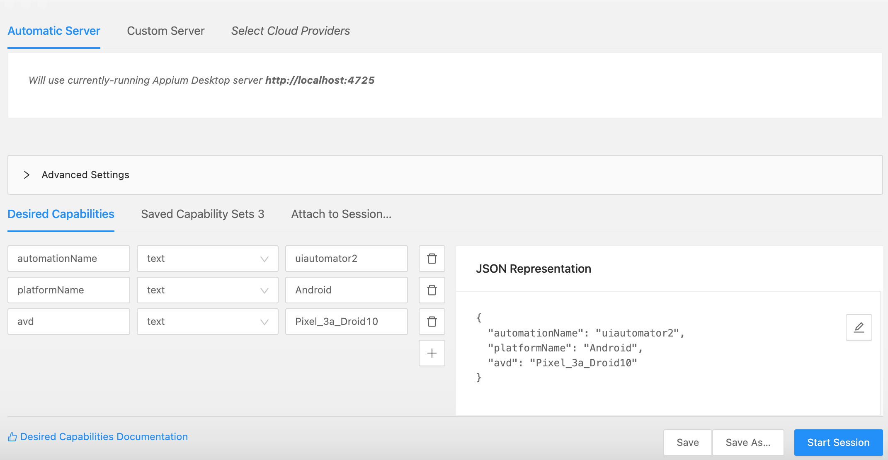
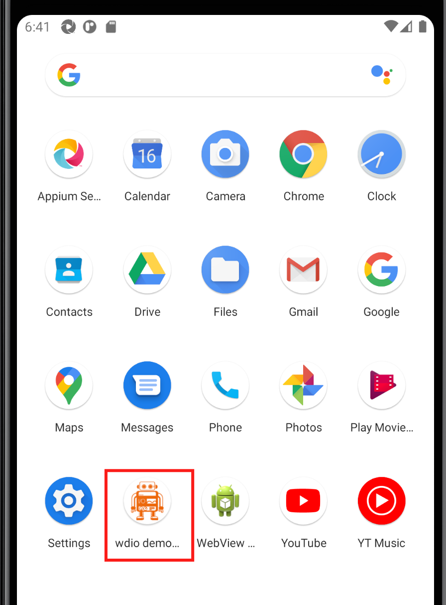
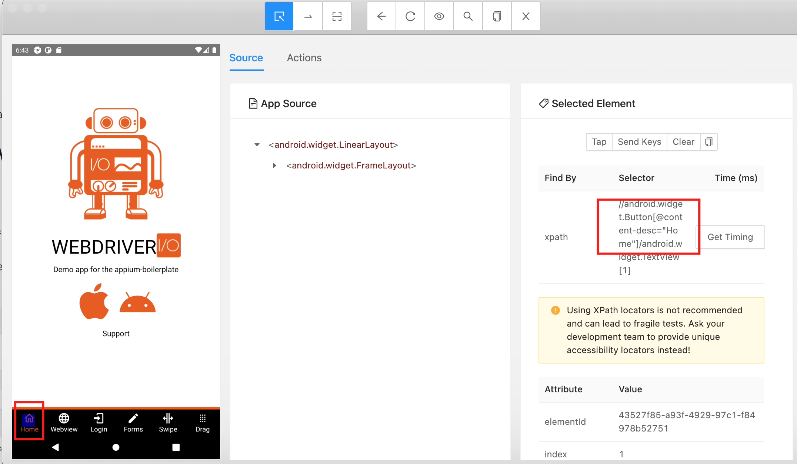
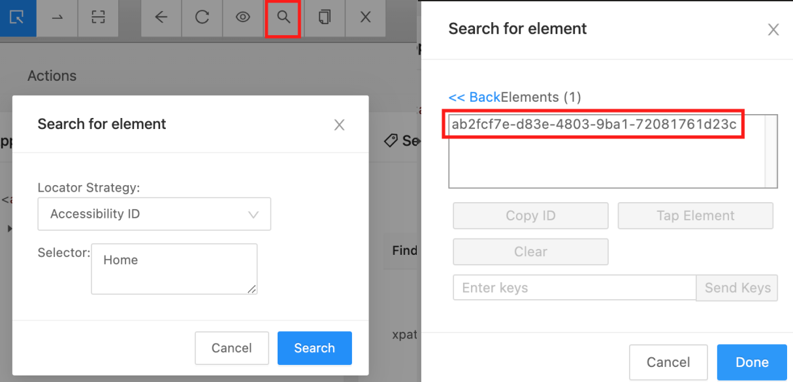
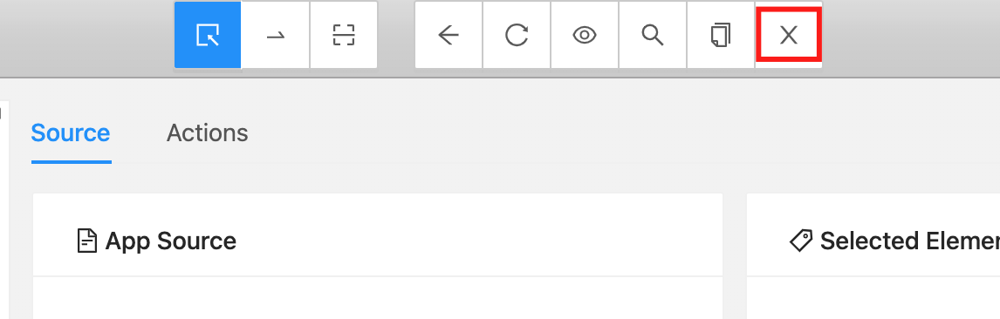
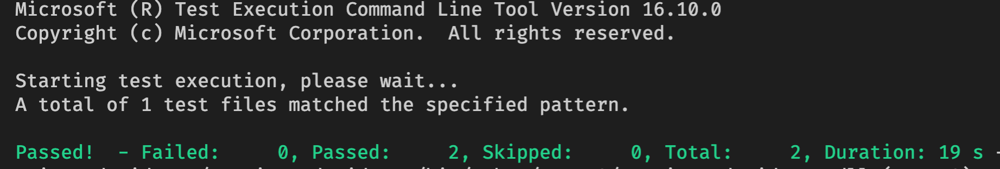
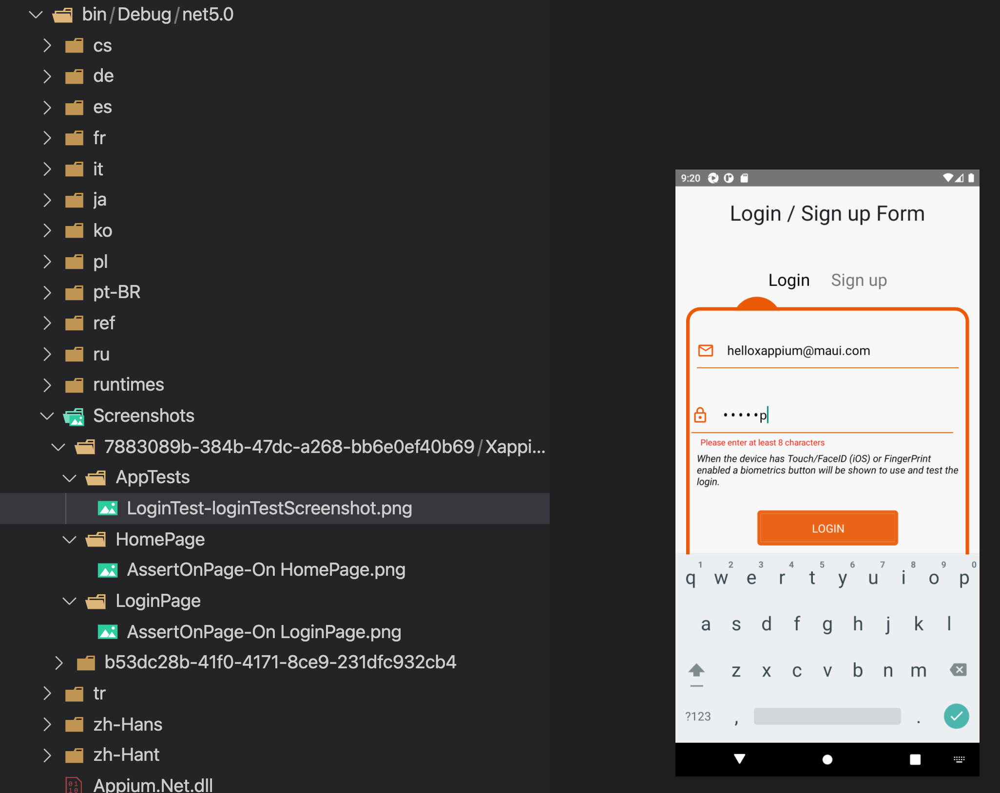

<br/>

Checkout [Xappium docs on Page Object Model](https://xappium.com/docs/page-object-model.html) pattern.


## Inspect mobile app with appium desktop
(see [Appium Desktop](https://mauiautomation.com/appium-desktop-locate-element/) overview post if this is your first time using it)

Start Appium Desktop on port `4725`
Start an inspector session with the following capabilities:




Install [wdio demo app](https://github.com/webdriverio/native-demo-app/releases) on the device if it is not there. Android emulator installation can be done by drag and drop the `.apk` file to the emulator.



Start the app.

On Appium UI Inspector session Hit `Start Session` to connect to the device.




`@content-desc` is the Accessibily ID in Android. AccessibilyID can be added when buiding app UI b adding `AutomationId` in Xamarin.Forms or `testId` in React Native.

  

This can be confirm by searching for element with AccessibilityID Home. And we found one element, which is the Home tab button.


## Writing HomePage object

Add `HomePage.cs` to the `XappiumAndroidTest` folder:

```csharp
using Xappium.UITest;
using Xappium.UITest.Pages;

namespace XappiumAndroidTest
{
	public class HomePage : BasePage
	{
		protected override string Trait => "Home-screen"; //(1)

		public LoginPage OpenLoginPage()
		{
			Engine.Tap("Login"); //(2)
			return new LoginPage();
		}
	}
}
```

> (1) : BasePage from Xappium require a `Trait` to be given. A Trait can be any element that exists on the screen, Trait is used to assert if the page is visible on screen or not. 
>
> (2) : Xappium Engine provide us a Tap method where it takes in an element Accessability ID and tap on it. (Automation ID in Xamarin).

Add `LoginPage.cs` to the `XappiumAndroidTest` folder:

```csharp
using Xappium.UITest;
using Xappium.UITest.Pages;

namespace XappiumAndroidTest
{
	public class LoginPage : BasePage
	{
		protected override string Trait => "Login-screen";

		public LoginPage EnterEmail(string email)
		{
			Engine.EnterText("input-email", email);
			return this;
		}

		public LoginPage EnterPassword(string password)
		{
			Engine.EnterText("input-password", password);
			return this;
		}

		public void TapLoginButton()
		{
			Engine.Tap("button-LOGIN");
		}
	}
}
```

Similarly to HomePage, for LoginPage we also have to provide a Trait, and there are methods corresponding to user actions on LoginPage which are use to login. All of these AccessabilityID can be found via Appium Desktop.

Add `LoginTest` to our `AppTests.cs` file:

```csharp
using NUnit.Framework;
using Xappium.UITest;

namespace XappiumAndroidTest
{
	public class AppTests : XappiumTestBase
	{
		[Test]
		public void AppLaunch()
		{

		}

		[Test]
		public void LoginTest()
		{
			var loginPage = new HomePage().OpenLoginPage();

			loginPage
				.EnterEmail("helloxappium@maui.com")
				.EnterPassword("csharp")
				.TapLoginButton();
			
			Engine.Screenshot("loginTestScreenshot");
		}
	}
}
```

By default, Xappium takes screenshot on each AssertOnPage, we can also take additional screenshot using `Engine.Screenshot("screenshotName")` method.


## Run test

Make sure to Quit Session and Close Inspector on Appium Desktop 



or you might get this error when run test

 ```json
 System.InvalidOperationException : A new session could not be created. Details: An unknown server-side error occurred while processing the command. Original error: java.lang.ExceptionInInitializerError.
 ```

As we use `espresso` for our test, but use `uiautomator2` for Appium Desktop. You can use `espresso` for Appium Desktop with appPackage as an additional parameter. 


Open terminal and run `dotnet test` . 

Test should now run and passed!



Screenshot took by Appium test run can be found in `bin/Debug/net5.0/Screeshots` folder




