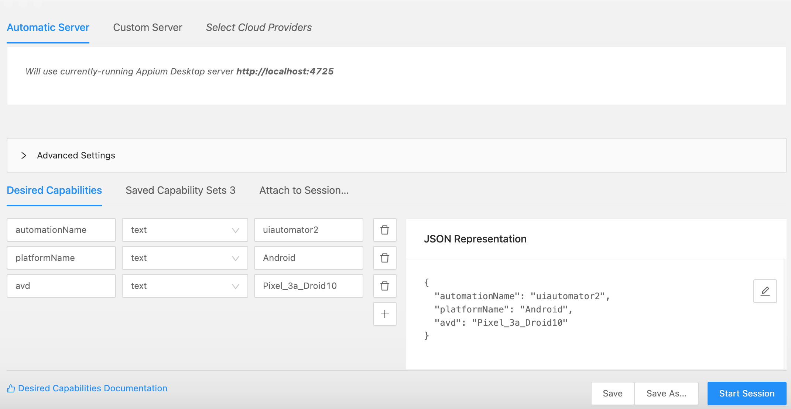
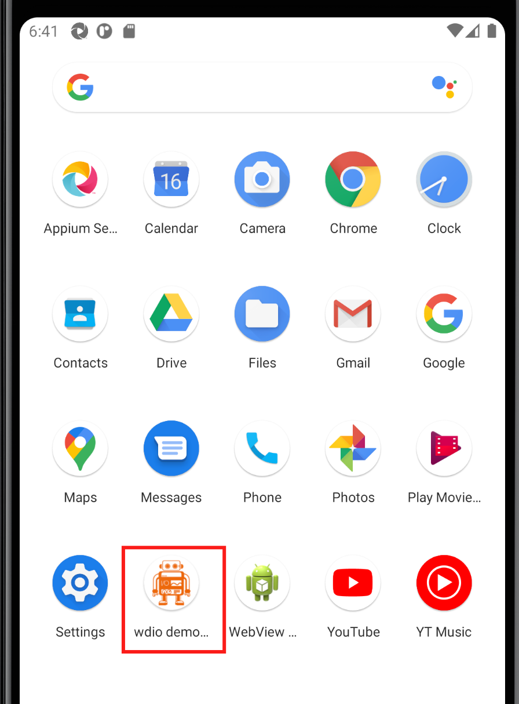
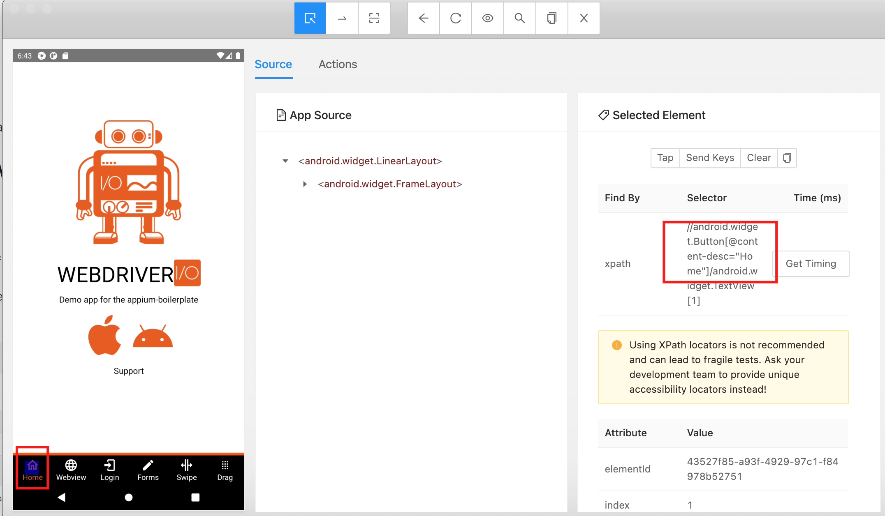
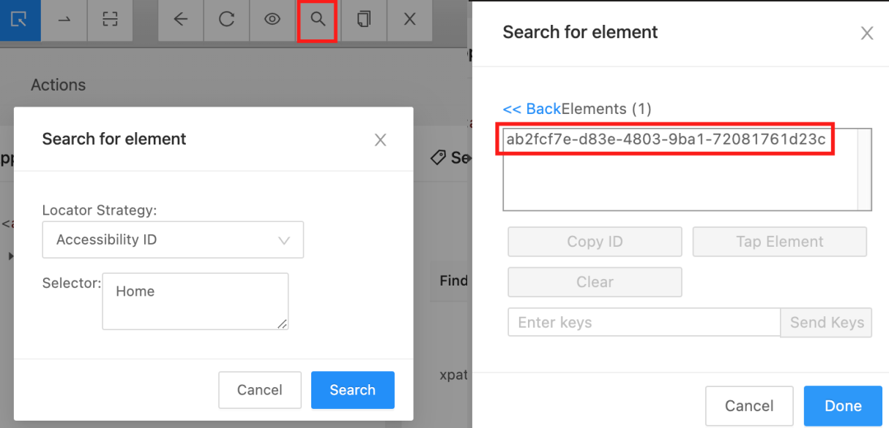

 

Checkout [Xappium docs on Page Object Model](https://xappium.com/docs/page-object-model.html) pattern.

## Inspect mobile app with appium desktop
(see [Appium Desktop](https://mauiautomation.com/appium-desktop-locate-element/) overview post if this is your first time using it)

Start Appium Desktop on port `4725`
Start an inspector session with the following capabilities:

Install [wdio demo app](https://github.com/webdriverio/native-demo-app/releases) on the device if it is not there. Android emulator installation can be done by drag and drop the `.apk` file to the emulator.

Start the app.

On Appium UI Inspector session Hit `Start Session` to connect to the device.

`@content-desc` is the Accessibily ID in Android. AccessibilyID can be added when buiding app UI b adding `AutomationId` in Xamarin.Forms or `testId` in React Native.

  

This can be confirm by searching for element with AccessibilityID Home. And we found one element, which is the Home tab button.

## Writing HomePage object

Add `HomePage.cs` to the `XappiumAndroidTest` folder.

